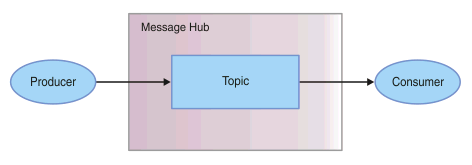

---

copyright:
  years: 2015, 2017
lastupdated: "2017-03-02"

---

{:new_window: target="_blank"}
{:shortdesc: .shortdesc}
{:screen: .screen}
{:codeblock: .codeblock}
{:pre: .pre}

# Einführung in Message Hub
{: #messagehub}


{{site.data.keyword.messagehub_full}} ist ein skalierbarer und verteilter Nachrichtenbus
mit hohem Durchsatz, mit dem Sie Ihre lokalen und externen Cloudtechnologien verbinden können.
{:shortdesc}

Mit {{site.data.keyword.messagehub}} können Sie die folgenden Tasks
ausführen:

* Microservices über offene Protokolle miteinander verbinden
* Streaming-Daten mit Analysen verbinden, um aussagekräftige Informationen zu erhalten
* Ereignisdaten mehreren Anwendungen zuführen, um in Echtzeit reagieren zu können

Mit {{site.data.keyword.messagehub}} können Sie beispielsweise
Bestandsänderungen veröffentlichen, einen zentralen Bus für Echtzeitdaten erstellen oder
Arbeit in Back-End-Verarbeitungsprozesse auslagern.

Als Einführung in die Verwendung von {{site.data.keyword.messagehub}} zum
Senden und Empfangen von Nachrichten können Sie das bereitgestellte Java™-Beispiel verwenden. Das
Beispiel verdeutlicht, wie Nachrichten unter Verwendung eines Topics von einem Producer an einen
Consumer gesendet werden. Das gleiche Beispielprogramm wird verwendet, um Nachrichten zu verarbeiten und
Nachrichten zu erstellen.




Führen Sie die folgenden Schritte aus:
{: #getting_started_steps}
 
1. Erstellen Sie eine {{site.data.keyword.messagehub}}-Serviceinstanz:

  a. Melden Sie sich über die Webbenutzerschnittstelle bei {{site.data.keyword.Bluemix_notm}} an. 
  
  b. Klicken Sie auf **KATALOG**.
  
  c. Klicken Sie im Abschnitt **Anwendungsservices** auf **{{site.data.keyword.messagehub}}**. Die Seite für die {{site.data.keyword.messagehub}}-Serviceinstanz wird geöffnet.
  
  d. Lassen Sie den Service im Menü **Verbindung herstellen zu** ohne Bindung und geben Sie Namen für Ihren Service und Ihre Berechtigungsnachweise ein. Sie können die Standardwerte verwenden.
  
  e. Klicken Sie auf **Erstellen**.

2. Installieren Sie die folgenden vorausgesetzten Komponenten (falls noch nicht vorhanden):

    * [git ](https://git-scm.com/){:new_window}
	* [Gradle ](https://gradle.org/){:new_window}
    * Java 7 oder höher
 
3. Klonen Sie das Git-Repository 'message-hub-samples', indem Sie den folgenden Befehl über die Befehlszeile ausführen:

    <pre class="pre">
    git clone https://github.com/ibm-messaging/message-hub-samples.git
    </pre>
	{: codeblock}

4. Wechseln Sie in das Verzeichnis mit dem Beispiel für die Java-Konsole, indem Sie den folgenden Befehl ausführen:

    <pre class="pre">
    cd message-hub-samples/kafka-java-console-sample
    </pre>
	{: codeblock}

5. Führen Sie die folgenden Erstellungsbefehle aus:

    <pre class="pre">
    gradle clean && gradle build
    </pre>
	{: codeblock}

6. Starten Sie den Consumer in Ihrer Konsole, indem Sie den folgenden Befehl ausführen:

    <pre class="pre">java -jar build/libs/kafka-java-console-sample-2.0.jar
	<var class="keyword varname">kafka_brokers_sasl</var> <var class="keyword varname">kafka_admin_url</var> <var class="keyword varname">api_key</var> -consumer</pre>
    {: codeblock}
    
    In dem Beispiel wird ein Topic mit dem Namen `kafka-java-console-sample-topic` verwendet. Wenn das Topic noch nicht
    vorhanden ist, wird es in dem Beispiel mithilfe der {{site.data.keyword.messagehub}}-Verwaltungs-API erstellt. Zum Senden und Empfangen
    von Nachrichten wird in dem Beispiel die Apache Kafka-Java-API verwendet.

    Um die Werte für *kafka_brokers_sasl*, *kafka_admin_url*
    und *api_key* zu ermitteln, wechseln Sie in Ihre {{site.data.keyword.messagehub}}-Instanz in {{site.data.keyword.Bluemix_notm}}, navigieren Sie zur Registerkarte **Serviceberechtigungsnachweise** und wählen Sie die **Berechtigungsnachweise** aus, die Sie verwenden möchten.
    
	**Wichtig:** *kafka_brokers_sasl* muss eine einzige Zeichenfolge sein, die in Anführungszeichen angegeben ist. Beispiel:

    <pre class="pre">
    "host1:port1,host2:port2"
    </pre>
	{: codeblock}

    Es wird empfohlen, alle Kafka-Hosts zu verwenden, die in den von Ihnen ausgewählten **Berechtigungsnachweisen** aufgelistet sind.

7. Starten Sie den Producer in Ihrer Konsole, indem Sie den folgenden Befehl ausführen:
   
    <pre class="pre">java -jar build/libs/kafka-java-console-sample-2.0.jar
	<var class="keyword varname">kafka_brokers_sasl</var> <var class="keyword varname">kafka_admin_url</var> <var class="keyword varname">api_key</var> -producer</pre>
 {: codeblock}
  
8. Nun müssten die vom Producer gesendeten Nachrichten im Consumer angezeigt werden. Im Folgenden ist eine
Beispielausgabe aufgelistet:

    ```
    [2016-11-30 17:30:53,492] INFO Running in local mode. (com.messagehub.samples.MessageHubConsoleSample)
    [2016-11-30 17:30:53,492] INFO Updating JAAS configuration (com.messagehub.samples.MessageHubConsoleSample)
    [2016-11-30 17:30:53,506] INFO Kafka Endpoints: kafka01-prod01.messagehub.services.us-south.bluemix.net:9093,kafka02-prod01.messagehub.services.us-south.bluemix.net:9093,kafka03-prod01.messagehub.services.us-south.bluemix.net:9093,kafka04-prod01.messagehub.services.us-south.bluemix.net:9093,kafka05-prod01.messagehub.services.us-south.bluemix.net:9093 (com.messagehub.samples.MessageHubConsoleSample)
    [2016-11-30 17:30:53,506] INFO Admin REST Endpoint: https://kafka-admin-prod01.messagehub.services.us-south.bluemix.net:443 (com.messagehub.samples.MessageHubConsoleSample)
    [2016-11-30 17:30:53,506] INFO Creating the topic kafka-java-console-sample-topic (com.messagehub.samples.MessageHubConsoleSample)
    (com.messagehub.samples.MessageHubConsoleSample)e :{}
    [2016-11-30 17:30:54,947] INFO Admin REST Listing Topics: [{"name":"kafka-java-console-sample-topic","partitions":1,"retentionMs":"86400000","markedForDeletion":false}] (com.messagehub.samples.MessageHubConsoleSample)
    [2016-11-30 17:30:55,952] INFO [Partition(topic = kafka-java-console-sample-topic, partition = 0, leader = 0, replicas = [0,1,4,], isr = [0,4,1,]] (com.messagehub.samples.ConsumerRunnable)
    [2016-11-30 17:30:55,953] INFO class com.messagehub.samples.ConsumerRunnable is starting. (com.messagehub.samples.ConsumerRunnable)
    [2016-11-30 17:30:57,023] INFO [Partition(topic = kafka-java-console-sample-topic, partition = 0, leader = 0, replicas = [0,1,4,], isr = [0,4,1,]] (com.messagehub.samples.ProducerRunnable)
    [2016-11-30 17:30:57,024] INFO MessageHubConsoleSample will run until interrupted. (com.messagehub.samples.MessageHubConsoleSample)
    [2016-11-30 17:30:57,024] INFO class com.messagehub.samples.ProducerRunnable is starting. (com.messagehub.samples.ProducerRunnable)
    [2016-11-30 17:30:58,018] INFO Message produced, offset: 0 (com.messagehub.samples.ProducerRunnable)
    [2016-11-30 17:30:58,956] INFO No messages consumed (com.messagehub.samples.ConsumerRunnable)
    [2016-11-30 17:31:00,301] INFO Message consumed: ConsumerRecord(topic = kafka-java-console-sample-topic, partition = 0, offset = 1, CreateTime = 1480527060022, checksum = 1906962734, serialized key size = 3, serialized value size = 25, key = key, value = This is a test message #1) (com.messagehub.samples.ConsumerRunnable)
    [2016-11-30 17:31:00,397] INFO Message produced, offset: 1 (com.messagehub.samples.ProducerRunnable)
    [2016-11-30 17:31:02,550] INFO Message consumed: ConsumerRecord(topic = kafka-java-console-sample-topic, partition = 0, offset = 2, CreateTime = 1480527062401, checksum = 3801731428, serialized key size = 3, serialized value size = 25, key = key, value = This is a test message #2) (com.messagehub.samples.ConsumerRunnable)
    ```
	{: codeblock}
	
9. Der Beispielprozess wird fortgesetzt, bis Sie ihn stoppen. Um den Prozess zu stoppen, führen Sie einen
Befehl wie den folgenden aus: <code>Strg+C</code>


Weitere Informationen zum Ausführen eines {{site.data.keyword.messagehub}}-Beispiels mit Python finden Sie unter [Beispielanwendung für Python-Konsole](https://developer.ibm.com/messaging/2017/02/09/new-message-hub-sample-python-console-application/){:new_window}. Anschauliche Beispiele für weitere APIs und Funktionen finden Sie unter
[{{site.data.keyword.messagehub}}-Beispiele ](https://github.com/ibm-messaging/message-hub-samples){:new_window}.

Ein Video, das Ihnen die Schritte zum Ausführen eines Java-Beispiels für {{site.data.keyword.messagehub}} zeigt, finden Sie
unter [{{site.data.keyword.messagehub}} - Getting started with IBM's Kafka in the cloud ](https://www.youtube.com/watch?v=tt-bLtFzC_4){:new_window}.

