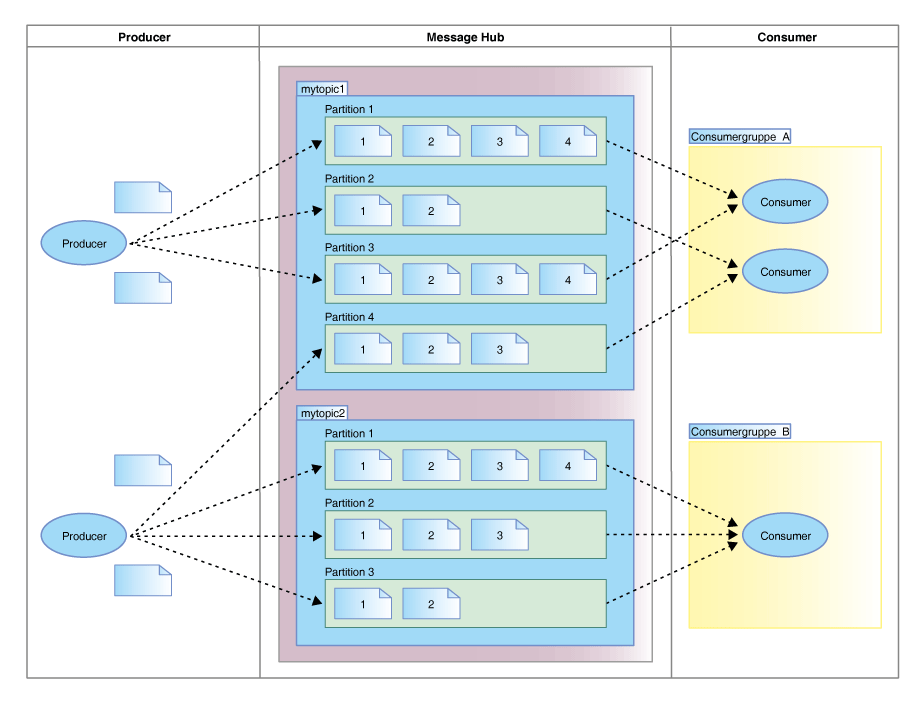

---

copyright:
  years: 2015, 2017
lastupdated: "2017-01-25"

---

{:new_window: target="_blank"}
{:shortdesc: .shortdesc}
{:screen: .screen}
{:codeblock: .codeblock}
{:pre: .pre}

# Message Hub und Apache Kafka
{: #apache_kafka}

Apache Kafka ist die Kernkomponente für zuverlässiges Messaging in {{site.data.keyword.messagehub}}. Dabei handelt es sich um ein Publish/Subscribe-Messaging-System, das fehlertolerant ist und eine Plattform für hohen Durchsatz und niedrige Latenz zur Verarbeitung von Echzeitdatenfeeds bereitstellt. Mit diesen Merkmalen ist das System ideal für die Verwendung in einer Cloudumgebung.
{:shortdesc}

 

Die folgende Liste enthält einige Apache Kafka-Konzepte:

<dl><dt>Topic</dt>
<dd>Ein Feed, in dem Nachrichten veröffentlicht werden.</dd>
<dt>Partition</dt>
<dd>Jedes Topic setzt sich aus einer oder mehreren Partitionen zusammen. Jede Partition ist eine sortierte Liste von Nachrichten. Wenn ein Topic mehr als eine Partition aufweist, können Daten parallel gespeist werden, um den Durchsatz zu erhöhen.</dd>
<dt>Producer</dt>
<dd>Ein Prozess, der Datenströme von Nachrichten in Kafka-Topics veröffentlicht. Ein Producer kann Datenströme in einem oder mehreren Topics veröffentlichen und optional die Partition auswählen, in denen die Daten gespeichert werden.</dd>
<dt>Consumer </dt>
<dd>Ein Prozess, der Nachrichten aus Kafka-Topics und den Feed von veröffentlichten Nachrichten verarbeitet. Ein Consumer kann mindestens ein Topic oder eine Partition abonnieren.</dd>
<dt>Consumergruppe</dt>
<dd>Ein benannte Gruppe aus einem oder mehreren Consumern. Jeder Consumer in der Gruppe liest Nachrichten aus bestimmten Partitionen in den Topics, die der Consumer abonniert hat. Jede Nachricht wird einem Consumer in der Gruppe bereitgestellt und alle Nachrichten mit demselben Schlüssel werden demselben Consumer bereitgestellt.

Jede Partition ist nur einem Consumer in der Gruppe zugeordnet.
 
<ul>
<li>Wenn es mehr Partitionen als Consumer in einer Gruppe gibt, haben einige Consumer mehrere Partitionen.</li>
<li>Wenn es mehr Consumer als Partitionen gibt, haben einige Consumer keine Partitionen.</li>
</ul>
</dd>
</dl>

Weitere Informationen hierzu finden Sie in der [Apache Kafka-Dokumentation ](http://kafka.apache.org/documentation.html){:new_window} und in dem developerWorks&reg;-Artikel [Message Hub Kafka Java&trade;](https://developer.ibm.com/messaging/2016/03/03/message-hub-kafka-java-api/){:new_window}.

