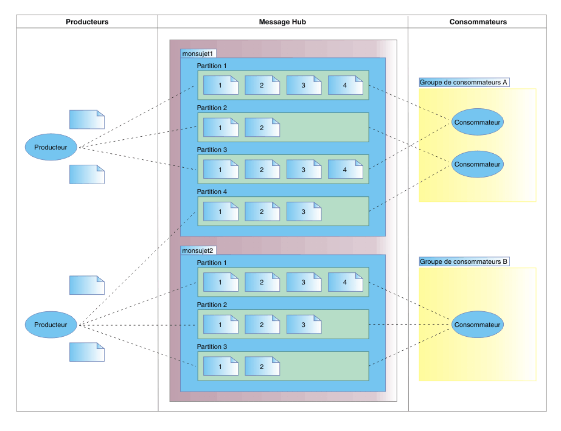

---

copyright:
  years: 2015, 2017
lastupdated: "2017-01-25"

---

{:new_window: target="_blank"}
{:shortdesc: .shortdesc}
{:screen: .screen}
{:codeblock: .codeblock}
{:pre: .pre}

# Message Hub et Apache Kafka
{: #apache_kafka}

Apache Kafka constitue le système principal Reliable Messaging de {{site.data.keyword.messagehub}}, de type publication-souscription, à tolérance de panne, qui fournit une plateforme à haute capacité de traitement et à faible temps d'attente pour une gestion des flux de données en temps réel. Ces caractéristiques en font un outil idéal pour une utilisation dans un environnement de cloud.
{:shortdesc}

 

La liste suivante présente certains concepts d'Apache Kafka :

<dl><dt>Sujet</dt>
<dd>Flux dans lequel des messages sont publiés.</dd>
<dt>Partition</dt>
<dd>Chaque sujet comporte une ou plusieurs partitions. Chaque partition est une liste ordonnée de messages. Si un sujet dispose de plusieurs partions, les données peuvent y être envoyées en parallèle afin d'augmenter le débit.</dd>
<dt>Producteur</dt>
<dd>Processus qui publie les flux de messages dans les sujets Kafka. Un producteur peut publier dans un ou plusieurs sujets et choisir éventuellement la partition qui stocke les données.</dd>
<dt>Consommateur </dt>
<dd>Processus qui consomme les messages des sujets Kafka et traite le flux des messages publiés. Un consommateur peut s'abonner à un ou plusieurs sujets ou partitions.</dd>
<dt>Groupe de consommateurs</dt>
<dd>Groupe nommé incluant un ou plusieurs consommateurs. Chaque consommateur du groupe lit les messages de partitions spécifiques dans les sujets auxquels il s'abonne. Chaque message est distribué à un consommateur du groupe et tous les messages avec la même clé sont envoyés au même consommateur.

Chaque partition est affectée à un consommateur du groupe uniquement.
 
<ul>
<li>S'il existe plus de partitions que de consommateurs dans un groupe, certains consommateurs ont plusieurs partitions.</li>
<li>S'il y a plus de consommateurs que de partitions, certains consommateurs n'ont pas de partitions.</li>
</ul>
</dd>
</dl>

Pour en savoir plus, voir la [documentation Apache Kafka ](http://kafka.apache.org/documentation.html){:new_window} et l'[article developerWorks&reg; Message Hub Kafka Java&trade; API ](https://developer.ibm.com/messaging/2016/03/03/message-hub-kafka-java-api/){:new_window}.

