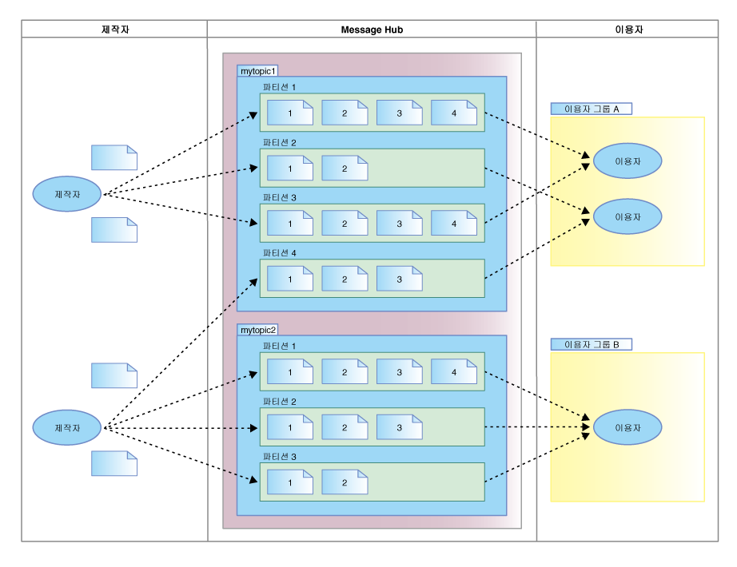

---

copyright:
  years: 2015, 2017
lastupdated: "2017-01-25"

---

{:new_window: target="_blank"}
{:shortdesc: .shortdesc}
{:screen: .screen}
{:codeblock: .codeblock}
{:pre: .pre}

# Message Hub 및 Apache Kafka
{: #apache_kafka}

Apache Kafka는 {{site.data.keyword.messagehub}}의 신뢰할 수 있는 메시징 코어를 형성합니다. 이는 공개-구독 메시징 시스템이며 내결함성이 있도록 디자인되어 실시간 데이터 피드 처리가 가능한 높은 처리량, 낮은 대기시간의 플랫폼을 제공합니다. 이러한 특징 덕분에 클라우드 환경에서 이상적으로 사용될 수 있습니다. {:shortdesc}

 

다음 목록은 일부 Apache Kafka 개념을 정의합니다. 

<dl><dt>토픽</dt>
<dd>메시지가 공개되는 피드입니다. </dd>
<dt>파티션</dt>
<dd>각 토픽은 하나 이상의 파티션으로 구성됩니다. 각 파티션은 메시지의 정렬된 목록입니다. 토픽에 둘 이상의 파티션이 있으면 처리량을 높이기 위해 병렬로 데이터가 피드될 수 있도록 허용합니다. </dd>
<dt>제작자</dt>
<dd>Kafka 토픽에 메시지 스트림을 공개하는 프로세스입니다. 제작자는 하나 이상의 토픽에 대해 공개하고, 선택사항으로 데이터를 저장하는 파티션을 선택할 수 있습니다. </dd>
<dt>이용자</dt>
<dd>Kafka 토픽의 메시지를 이용하고 공개된 메시지의 피드를 처리하는 프로세스입니다. 이용자는 하나 이상의 토픽 또는 파티션을 구독할 수 있습니다.</dd>
<dt>이용자 그룹</dt>
<dd>하나 이상의 이용자로 이루어진 이름이 지정된 그룹입니다. 그룹의 각 이용자는 이용자가 구독하는 토픽의 특정 파티션에서 메시지를 읽습니다. 각 메시지는 그룹의 한 이용자에게 전달되고 동일한 키가 있는 모든 메시지가 동일한 이용자에게 전달됩니다. 
각 파티션은 그룹의 한 이용자에게만 지정됩니다. 
 
<ul>
<li>그룹의 이용자보다 많은 파티션이 있을 경우 일부 이용자는 복수의 파티션을 가집니다. </li>
<li>파티션보다 많은 이용자가 있을 경우 일부 이용자는 파티션이 없습니다. </li>
</ul>
</dd>
</dl>

자세히 알아보려면 [Apache Kafka 문서 ](http://kafka.apache.org/documentation.html){:new_window} 및 [Message Hub Kafka Java&trade; API developerWorks&reg; 기사 ](https://developer.ibm.com/messaging/2016/03/03/message-hub-kafka-java-api/){:new_window}을 참조하십시오.

