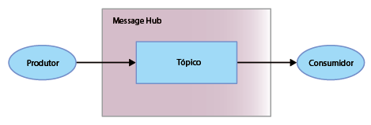

---

copyright:
  years: 2015, 2017
lastupdated: "2017-03-02"

---

{:new_window: target="_blank"}
{:shortdesc: .shortdesc}
{:screen: .screen}
{:codeblock: .codeblock}
{:pre: .pre}

# Introdução ao Message Hub
{: #messagehub}


O {{site.data.keyword.messagehub_full}} é um barramento de mensagem escalável, distribuído e de
alto rendimento para unificar suas tecnologias de nuvem no local e externamente.
{:shortdesc}

Usando o {{site.data.keyword.messagehub}}, é possível concluir as seguintes tarefas:

* Ligar microsserviços usando protocolos abertos
* Conectar dados em fluxo para análise para realizar insights poderosos
* Alimentar dados de eventos para vários aplicativos para reagir em tempo real

Por exemplo, é possível usar o {{site.data.keyword.messagehub}} para publicar mudanças no
inventário, criar um barramento centralizado para dados em tempo real ou permitir que aplicativos
transfiram o trabalho para processos do trabalhador de backend.

Para iniciar com o {{site.data.keyword.messagehub}} e começar a enviar e a receber mensagens, use a
amostra Java™. A amostra exibe como um produtor envia mensagens para um consumidor usando um tópico. O
mesmo programa de amostra é usado para consumir e produzir mensagens.




Execute as seguintes etapas:
{: #getting_started_steps}
 
1. Crie uma instância de serviço do {{site.data.keyword.messagehub}}:

  a. Efetue login no {{site.data.keyword.Bluemix_notm}} usando a interface com o usuário da web. 
  
  b. Clique em **CATÁLOGO**.
  
  c. Na seção **Application Services**, clique em
**{{site.data.keyword.messagehub}}**. A página da instância de serviço
do {{site.data.keyword.messagehub}} é aberta.
  
  d. Deixe o serviço desvinculado no menu **Conectar** e insira nomes
para seu serviço e suas credenciais. É possível usar os valores padrão.
  
  e. Clique em **Criar**.

2. Se você ainda não os tiver, instale os seguintes pré-requisitos:

    * [git
](https://git-scm.com/){:new_window}
	* [Gradle ](https://gradle.org/){:new_window}

    * Java 7 ou superior
 
3. Clone o repositório Git message-hub-samples executando o comando a seguir na linha de
comandos:

    <pre class="pre">
    git clone https://github.com/ibm-messaging/message-hub-samples.git
    </pre>
	{: codeblock}

4. Mude o diretório para a amostra do console java executando o comando a seguir:

    <pre class="pre">
    cd message-hub-samples/kafka-java-console-sample
    </pre>
	{: codeblock}

5. Execute os seguintes comandos de construção:

    <pre class="pre">
    gradle clean && gradle build
    </pre>
	{: codeblock}

6. Inicie o consumidor em seu console executando o comando a seguir:

    <pre class="pre">java -jar build/libs/kafka-java-console-sample-2.0.jar 
	<var class="keyword varname">kafka_brokers_sasl</var> <var class="keyword varname">kafka_admin_url</var> <var class="keyword varname">api_key</var> -consumer</pre>
    {: codeblock}
    
    A amostra usa um tópico denominado `kafka-java-console-sample-topic`. Se o tópico
ainda não existir, a amostra o criará usando a API de administração do {{site.data.keyword.messagehub}}.
Para enviar e receber mensagens, a amostra usa a API do Apache Kafka Java.

    Para localizar os valores para *kafka_brokers_sasl*, *kafka_admin_url*
e *api_key*, acesse a instância do {{site.data.keyword.messagehub}} no
{{site.data.keyword.Bluemix_notm}}, acesse a guia **Credenciais de serviço** e
selecione as **Credenciais** que você deseja usar.
    
	**Importante:** *kafka_brokers_sasl* deve ser uma sequência única, que
deve ser colocada entre aspas. Por exemplo:

    <pre class="pre">
    "host1:port1,host2:port2"
    </pre>
	{: codeblock}

    Recomendamos usar todos os hosts do Kafka listados nas **Credenciais** que você
selecionou.

7. Inicie o produtor em seu console executando o comando a seguir:
   
    <pre class="pre">java -jar build/libs/kafka-java-console-sample-2.0.jar 
	<var class="keyword varname">kafka_brokers_sasl</var> <var class="keyword varname">kafka_admin_url</var> <var class="keyword varname">api_key</var> -producer</pre>
 {: codeblock}
  
8. Agora as mensagens enviadas pelo produtor deverão aparecer no consumidor. A seguir está uma saída de
amostra:

    ```
    [2016-11-30 17:30:53,492] INFO Running in local mode. (com.messagehub.samples.MessageHubConsoleSample)
    [2016-11-30 17:30:53,492] INFO Updating JAAS configuration (com.messagehub.samples.MessageHubConsoleSample)
    [2016-11-30 17:30:53,506] INFO Kafka Endpoints: kafka01-prod01.messagehub.services.us-south.bluemix.net:9093,kafka02-prod01.messagehub.services.us-south.bluemix.net:9093,kafka03-prod01.messagehub.services.us-south.bluemix.net:9093,kafka04-prod01.messagehub.services.us-south.bluemix.net:9093,kafka05-prod01.messagehub.services.us-south.bluemix.net:9093 (com.messagehub.samples.MessageHubConsoleSample)
    [2016-11-30 17:30:53,506] INFO Admin REST Endpoint: https://kafka-admin-prod01.messagehub.services.us-south.bluemix.net:443 (com.messagehub.samples.MessageHubConsoleSample)
    [2016-11-30 17:30:53,506] INFO Creating the topic kafka-java-console-sample-topic (com.messagehub.samples.MessageHubConsoleSample)
    (com.messagehub.samples.MessageHubConsoleSample)e :{}
    [2016-11-30 17:30:54,947] INFO Admin REST Listing Topics: [{"name":"kafka-java-console-sample-topic","partitions":1,"retentionMs":"86400000","markedForDeletion":false}] (com.messagehub.samples.MessageHubConsoleSample)
    [2016-11-30 17:30:55,952] INFO [Partition(topic = kafka-java-console-sample-topic, partition = 0, leader = 0, replicas = [0,1,4,], isr = [0,4,1,]] (com.messagehub.samples.ConsumerRunnable)
    [2016-11-30 17:30:55,953] INFO class com.messagehub.samples.ConsumerRunnable is starting. (com.messagehub.samples.ConsumerRunnable)
    [2016-11-30 17:30:57,023] INFO [Partition(topic = kafka-java-console-sample-topic, partition = 0, leader = 0, replicas = [0,1,4,], isr = [0,4,1,]] (com.messagehub.samples.ProducerRunnable)
    [2016-11-30 17:30:57,024] INFO MessageHubConsoleSample will run until interrupted. (com.messagehub.samples.MessageHubConsoleSample)
    [2016-11-30 17:30:57,024] INFO class com.messagehub.samples.ProducerRunnable is starting. (com.messagehub.samples.ProducerRunnable)
    [2016-11-30 17:30:58,018] INFO Message produced, offset: 0 (com.messagehub.samples.ProducerRunnable)
    [2016-11-30 17:30:58,956] INFO No messages consumed (com.messagehub.samples.ConsumerRunnable)
    [2016-11-30 17:31:00,301] INFO Message consumed: ConsumerRecord(topic = kafka-java-console-sample-topic, partition = 0, offset = 1, CreateTime = 1480527060022, checksum = 1906962734, serialized key size = 3, serialized value size = 25, key = key, value = This is a test message #1) (com.messagehub.samples.ConsumerRunnable)
    [2016-11-30 17:31:00,397] INFO Message produced, offset: 1 (com.messagehub.samples.ProducerRunnable)
    [2016-11-30 17:31:02,550] INFO Message consumed: ConsumerRecord(topic = kafka-java-console-sample-topic, partition = 0, offset = 2, CreateTime = 1480527062401, checksum = 3801731428, serialized key size = 3, serialized value size = 25, key = key, value = This is a test message #2) (com.messagehub.samples.ConsumerRunnable)
    ```
	{: codeblock}
	
9. A amostra é executada indefinidamente até que ela seja interrompida. Para parar o processo, execute
um comando como segue: <code>Ctrl+C</code>


Para saber mais sobre como executar uma amostra do {{site.data.keyword.messagehub}} usando Python, consulte [Aplicativo de amostra de console do Python ](https://developer.ibm.com/messaging/2017/02/09/new-message-hub-sample-python-console-application/){:new_window}. Também é possível localizar amostras
que demonstram outras APIs e recursos nas amostras do [{{site.data.keyword.messagehub}} ](https://github.com/ibm-messaging/message-hub-samples){:new_window}.

Para assistir a um vídeo que o
guiará na obtenção de uma amostra Java para executar com relação ao {{site.data.keyword.messagehub}}, consulte [{{site.data.keyword.messagehub}} - Introdução ao Kafka da IBM na nuvem ](https://www.youtube.com/watch?v=tt-bLtFzC_4){:new_window}.

