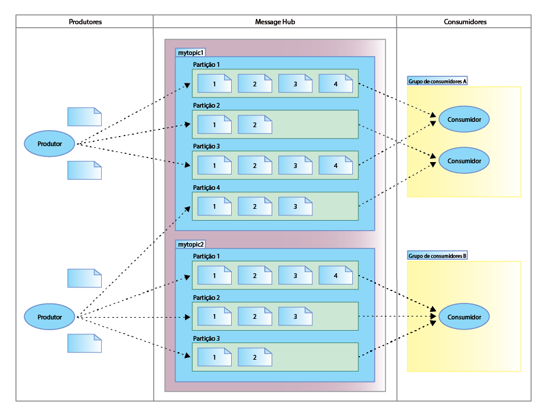

---

copyright:
  years: 2015, 2017
lastupdated: "2017-01-25"

---

{:new_window: target="_blank"}
{:shortdesc: .shortdesc}
{:screen: .screen}
{:codeblock: .codeblock}
{:pre: .pre}

# Message Hub e Apache Kafka
{: #apache_kafka}

O Apache Kafka forma o núcleo do sistema de mensagens confiável do {{site.data.keyword.messagehub}}. É um
    sistema de mensagens de publicação/assinatura e é projetado para ser tolerante a falhas fornecendo
    uma plataforma de alta produtividade e baixa latência para manipular alimentações de dados em tempo real. Essas características o tornam ideal para uso em um ambiente em nuvem.
{:shortdesc}

 

A lista a seguir define alguns conceitos do Apache Kafka:

<dl><dt>Tópico</dt>
<dd>Um feed em que as mensagens são publicadas.</dd>
<dt>Partição</dt>
<dd>Cada tópico abrange uma ou mais partições. Cada partição está em uma lista ordenada de
            mensagens. Se um tópico tiver mais de uma partição, ele permitirá que os dados sejam alimentados
            em paralelo para aumentar o rendimento.</dd>
<dt>Produtor</dt>
<dd>Um processo que publica fluxos de mensagens para tópicos do Kafka. Um produtor pode publicar
            um ou mais tópicos e escolher, opcionalmente, a partição que armazena os dados.</dd>
<dt>Consumidor </dt>
<dd>Um processo que consome mensagens dos tópicos do Kafka e processa a
            alimentação de mensagens publicadas. Um consumidor pode assinar um ou mais tópicos ou partições.</dd>
<dt>Grupo de consumidores</dt>
<dd>Um grupo nomeado de um ou mais consumidores. Cada consumidor no grupo lê mensagens de partições
            específicas nos tópicos que o consumidor assina. Cada mensagem é entregue
            a um consumidor no grupo e todas as mensagens com a mesma chave são entregues ao
            mesmo consumidor.

Cada partição é designada a somente um consumidor no grupo.
 
<ul>
<li>Se houver mais partições do que consumidores em um grupo, alguns consumidores terão
                  diversas partições.</li>
<li>Se houver mais consumidores do que partições, alguns não terão
                  partições.</li>
</ul>
</dd>
</dl>

Para saber mais, consulte [Documentação do Apache Kafka ](http://kafka.apache.org/documentation.html){:new_window} e [Artigo API do Message Hub Kafka Java&trade; no developerWorks&reg; ](https://developer.ibm.com/messaging/2016/03/03/message-hub-kafka-java-api/){:new_window}.

