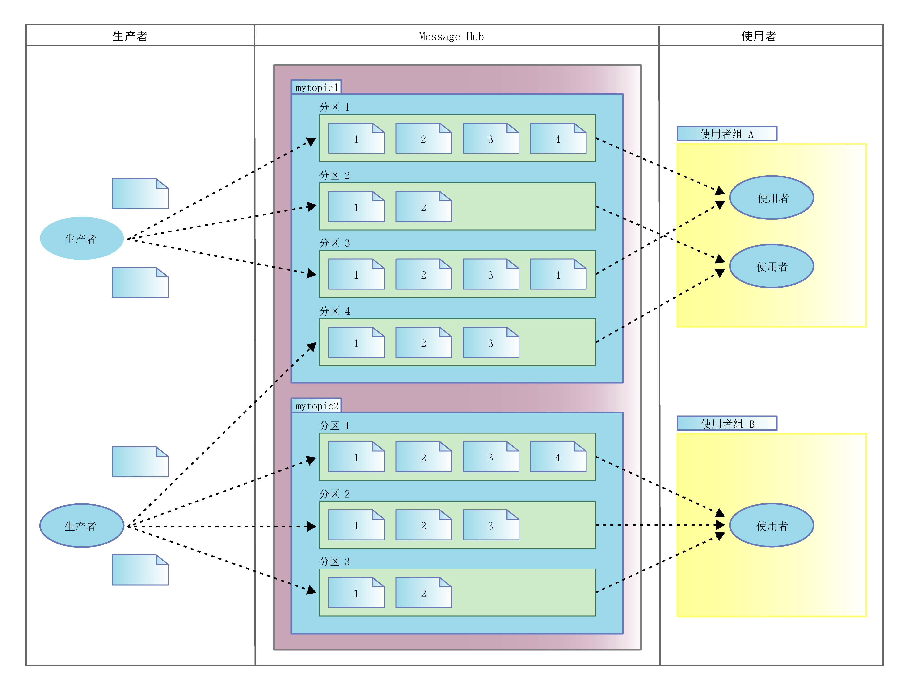

---

copyright:
  years: 2015, 2017
lastupdated: "2017-01-25"

---

{:new_window: target="_blank"}
{:shortdesc: .shortdesc}
{:screen: .screen}
{:codeblock: .codeblock}
{:pre: .pre}

# Message Hub 和 Apache Kafka
{: #apache_kafka}

Apache Kafka 构成了 {{site.data.keyword.messagehub}} 的可靠消息传递核心。它是一个发布-预订消息传递系统，其设计具有容错能力，提供等待时间短的高吞吐量平台以处理实时数据订阅源。这些特征让其成为云环境中使用的理想之选。
{:shortdesc}

 

下面的列表定义了 Apache Kafka 的部分概念：

<dl><dt>主题</dt>
<dd>消息所发布到的订阅源。</dd>
<dt>分区</dt>
<dd>每个主题包含一个或多个分区。每个分区都是一个有序的消息列表。如果某个主题具有一个以上的分区，那么数据可以并行馈送以提高吞吐量。</dd>
<dt>生产者</dt>
<dd>向 Kafka 主题发布消息流的过程。生产者可以发布一个或更多主题，并且可以选择用于存储数据的分区。</dd>
<dt>使用者</dt>
<dd>使用 Kafka 主题的消息，以及对已发布消息的订阅源进行处理的过程。使用者可以预订一个或多个主题或分区。</dd>
<dt>使用者组</dt>
<dd>一个或多个使用者的命名组。组中每个使用者读取使用者预订的主题中特定分区的消息。每个消息传递给组中一个使用者，具有相同密钥的所有消息都传递给同一个使用者。
每个分区只分配给组中一个使用者。
 
<ul>
<li>如果分区数量多于组中使用者数量，那么部分使用者拥有多个分区。</li>
<li>如果使用者数量多于分区数量，那么部分使用者没有分区。</li>
</ul>
</dd>
</dl>

要了解更多信息，请参阅 [Apache Kafka 文档 ](http://kafka.apache.org/documentation.html){:new_window} 和 [Message Hub Kafka Java&trade; API developerWorks&reg; 文章 ](https://developer.ibm.com/messaging/2016/03/03/message-hub-kafka-java-api/){:new_window}。

