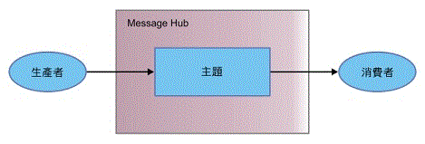

---

copyright:
  years: 2015, 2017
lastupdated: "2017-03-02"

---

{:new_window: target="_blank"}
{:shortdesc: .shortdesc}
{:screen: .screen}
{:codeblock: .codeblock}
{:pre: .pre}

# 開始使用 Message Hub
{: #messagehub}


{{site.data.keyword.messagehub_full}} 是一個可擴充的分散式高傳輸量訊息匯流排，用來統一內部部署與外部部署的雲端技術。
{:shortdesc}

使用 {{site.data.keyword.messagehub}}，您可以完成下列作業：

* 使用開放通訊協定將微服務串連在一起
* 連接串流資料與分析，以實現強大的見解
* 將事件資料提供給多個應用程式，即時回應

例如，您可以使用 {{site.data.keyword.messagehub}} 來發佈庫存變更、建立即時資料的集中化匯流排，或是讓應用程式能將工作卸載至後端工作者處理程序。

若要開始使用 {{site.data.keyword.messagehub}} 和開始傳送及接收訊息，請使用 Java™ 範例。範例顯示生產者如何使用主題將訊息傳送到消費者。相同的範例程式用來使用訊息，以及產生訊息。




請完成下列步驟：
{: #getting_started_steps}
 
1. 建立 {{site.data.keyword.messagehub}} 服務實例：

  a. 使用 Web 使用者介面登入 {{site.data.keyword.Bluemix_notm}}。 
  
  b. 按一下**型錄**。
  
  c. 在**應用程式服務**區段中，按一下 **{{site.data.keyword.messagehub}}**。即會開啟 {{site.data.keyword.messagehub}} 服務實例頁面。
  
  d. 在**連接至**功能表中將服務維持為不連結狀態，然後輸入服務的名稱以及您的認證。您可以使用預設值。
  
  e. 按一下**建立**。

2. 如果您還沒有下列必要條件，請安裝它們：

    * [git ](https://git-scm.com/){:new_window}
	* [Gradle ](https://gradle.org/){:new_window}
    * Java 7 或更高版本
 
3. 從指令行執行下列指令，以複製 message-hub-samples git 儲存庫：

    <pre class="pre">
    git clone https://github.com/ibm-messaging/message-hub-samples.git
    </pre>
	{: codeblock}

4. 執行下列指令切換至 Java 主控台範例目錄：

    <pre class="pre">
    cd message-hub-samples/kafka-java-console-sample
    </pre>
	{: codeblock}

5. 執行下列建置指令：

    <pre class="pre">
    gradle clean && gradle build
    </pre>
	{: codeblock}

6. 執行下列指令，在主控台上啟動消費者：

    <pre class="pre">java -jar build/libs/kafka-java-console-sample-2.0.jar 
	<var class="keyword varname">kafka_brokers_sasl</var> <var class="keyword varname">kafka_admin_url</var> <var class="keyword varname">api_key</var> -consumer</pre>
    {: codeblock}
    
    此範例使用名為 `kafka-java-console-sample-topic` 的主題。如果主題尚不存在，範例會使用 {{site.data.keyword.messagehub}} 管理 API 建立它。為了傳送及接收訊息，範例會使用 Apache Kafka Java API。

    若要找出 *kafka_brokers_sasl*、*kafka_admin_url* 及 *api_key* 的值，請在 {{site.data.keyword.Bluemix_notm}} 中移至 {{site.data.keyword.messagehub}} 實例、**服務認證**標籤，然後選取您要使用的**認證**。
    
	**重要事項：***kafka_brokers_sasl* 必須是單一字串，並且您必須以單引號括住它。例如：

    <pre class="pre">
    "host1:port1,host2:port2"
    </pre>
	{: codeblock}

    我們建議您使用所選取**認證**中列出的所有 Kafka 主機。

7. 執行下列指令，在主控台上啟動生產者：
   
    <pre class="pre">java -jar build/libs/kafka-java-console-sample-2.0.jar 
	<var class="keyword varname">kafka_brokers_sasl</var> <var class="keyword varname">kafka_admin_url</var> <var class="keyword varname">api_key</var> -producer</pre>
 {: codeblock}
  
8. 您現在應該會看到生產者傳送的訊息出現在消費者。以下是部分範例輸出：

    ```
    [2016-11-30 17:30:53,492] INFO Running in local mode. (com.messagehub.samples.MessageHubConsoleSample)
    [2016-11-30 17:30:53,492] INFO Updating JAAS configuration (com.messagehub.samples.MessageHubConsoleSample)
    [2016-11-30 17:30:53,506] INFO Kafka Endpoints: kafka01-prod01.messagehub.services.us-south.bluemix.net:9093,kafka02-prod01.messagehub.services.us-south.bluemix.net:9093,kafka03-prod01.messagehub.services.us-south.bluemix.net:9093,kafka04-prod01.messagehub.services.us-south.bluemix.net:9093,kafka05-prod01.messagehub.services.us-south.bluemix.net:9093 (com.messagehub.samples.MessageHubConsoleSample)
    [2016-11-30 17:30:53,506] INFO Admin REST Endpoint: https://kafka-admin-prod01.messagehub.services.us-south.bluemix.net:443 (com.messagehub.samples.MessageHubConsoleSample)
    [2016-11-30 17:30:53,506] INFO Creating the topic kafka-java-console-sample-topic (com.messagehub.samples.MessageHubConsoleSample)
    (com.messagehub.samples.MessageHubConsoleSample)e :{}
    [2016-11-30 17:30:54,947] INFO Admin REST Listing Topics: [{"name":"kafka-java-console-sample-topic","partitions":1,"retentionMs":"86400000","markedForDeletion":false}] (com.messagehub.samples.MessageHubConsoleSample)
    [2016-11-30 17:30:55,952] INFO [Partition(topic = kafka-java-console-sample-topic, partition = 0, leader = 0, replicas = [0,1,4,], isr = [0,4,1,]] (com.messagehub.samples.ConsumerRunnable)
    [2016-11-30 17:30:55,953] INFO class com.messagehub.samples.ConsumerRunnable is starting. (com.messagehub.samples.ConsumerRunnable)
    [2016-11-30 17:30:57,023] INFO [Partition(topic = kafka-java-console-sample-topic, partition = 0, leader = 0, replicas = [0,1,4,], isr = [0,4,1,]] (com.messagehub.samples.ProducerRunnable)
    [2016-11-30 17:30:57,024] INFO MessageHubConsoleSample will run until interrupted. (com.messagehub.samples.MessageHubConsoleSample)
    [2016-11-30 17:30:57,024] INFO class com.messagehub.samples.ProducerRunnable is starting. (com.messagehub.samples.ProducerRunnable)
    [2016-11-30 17:30:58,018] INFO Message produced, offset: 0 (com.messagehub.samples.ProducerRunnable)
    [2016-11-30 17:30:58,956] INFO No messages consumed (com.messagehub.samples.ConsumerRunnable)
    [2016-11-30 17:31:00,301] INFO Message consumed: ConsumerRecord(topic = kafka-java-console-sample-topic, partition = 0, offset = 1, CreateTime = 1480527060022, checksum = 1906962734, serialized key size = 3, serialized value size = 25, key = key, value = This is a test message #1) (com.messagehub.samples.ConsumerRunnable)
    [2016-11-30 17:31:00,397] INFO Message produced, offset: 1 (com.messagehub.samples.ProducerRunnable)
    [2016-11-30 17:31:02,550] INFO Message consumed: ConsumerRecord(topic = kafka-java-console-sample-topic, partition = 0, offset = 2, CreateTime = 1480527062401, checksum = 3801731428, serialized key size = 3, serialized value size = 25, key = key, value = This is a test message #2) (com.messagehub.samples.ConsumerRunnable)
    ```
	{: codeblock}
	
9. 範例會無限制地執行，直到您停止它為止。若要停止處理程序，請執行如下的指令：<code>Ctrl+C</code>


若要進一步瞭解使用 Python 執行 {{site.data.keyword.messagehub}} 範例的相關資訊，請參閱 [Python 主控台範例應用程式 ](https://developer.ibm.com/messaging/2017/02/09/new-message-hub-sample-python-console-application/){:new_window}。您也可以在 [{{site.data.keyword.messagehub}} 範例 ](https://github.com/ibm-messaging/message-hub-samples){:new_window} 找到示範其他 API 及特性的範例。

若要觀看帶領您對 {{site.data.keyword.messagehub}} 執行 Java 範例的視訊，請參閱 [{{site.data.keyword.messagehub}} - Getting started with IBM's Kafka in the cloud ](https://www.youtube.com/watch?v=tt-bLtFzC_4){:new_window}。

