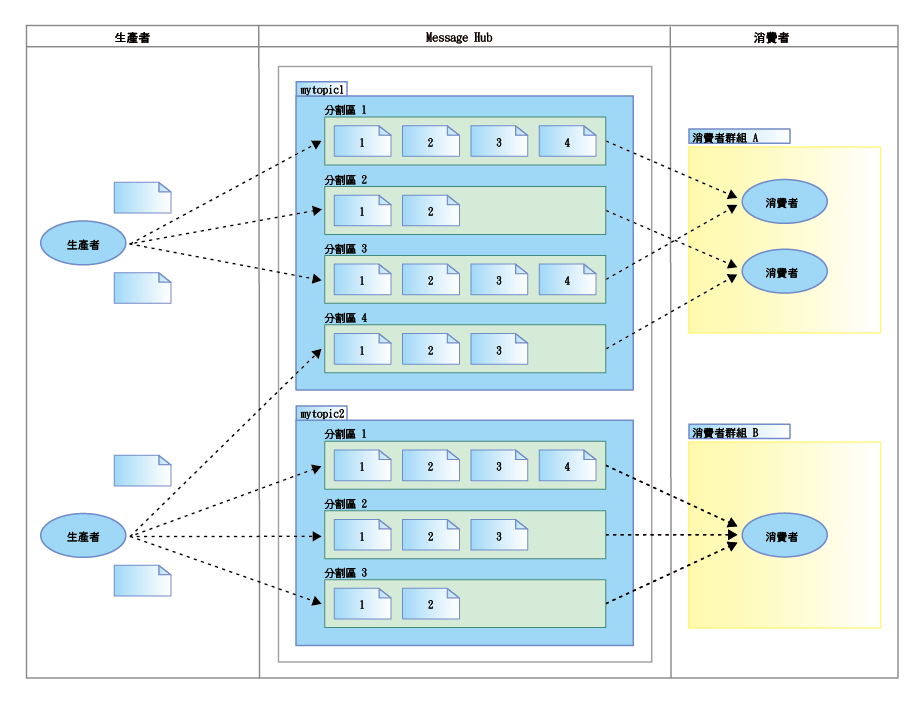

---

copyright:
  years: 2015, 2017
lastupdated: "2017-01-25"

---

{:new_window: target="_blank"}
{:shortdesc: .shortdesc}
{:screen: .screen}
{:codeblock: .codeblock}
{:pre: .pre}

# Message Hub 及 Apache Kafka
{: #apache_kafka}

Apache Kafka 形成了 {{site.data.keyword.messagehub}} 的可靠傳訊核心。它是一個發佈/訂閱傳訊系統，設計成具有容錯功能以提供高傳輸量、低延遲時間的平台，用來處理即時資料饋送。這些性質使其適合用於雲端環境。
{:shortdesc}

 

下列清單定義部分 Apache Kafka 概念：

<dl><dt>主題</dt>
<dd>訊息發佈目標的饋送。</dd>
<dt>分割區</dt>
<dd>每個主題包含一個以上的分割區。每一個分割區都是訊息的排序清單。如果某個主題具有多個分割區，它容許同時饋送資料以增加傳輸量。</dd>
<dt>生產者</dt>
<dd>將訊息串流發佈至 Kafka 主題的處理程序。生產者可以發佈至一個以上的主題，也可以選擇性地選擇用來儲存資料的分割區。</dd>
<dt>消費者</dt>
<dd>從 Kafka 主題取用訊息，以及處理已發佈訊息之饋送的處理程序。消費者可以訂閱一個以上的主題或分割區。</dd>
<dt>消費者群組</dt>
<dd>包含一個以上消費者的具名群組。群組中的每一個消費者都會從該消費者所訂閱之主題的特定分割區中讀取訊息。每個訊息都會傳遞給群組中的一個消費者，而所有具有相同索引鍵的訊息則會傳遞給相同的消費者。

每一個分割區只能指派給群組中的一個消費者。
 
<ul>
<li>如果分割區多於群組中的消費者，則某些消費者具有多個分割區。</li>
<li>如果消費者多於分割區，則某些消費者沒有任何分割區。</li>
</ul>
</dd>
</dl>

若要進一步瞭解，請參閱 [Apache Kafka 文件 ](http://kafka.apache.org/documentation.html){:new_window} 及 [Message Hub Kafka Java&trade; API developerWorks&reg; 文章 ](https://developer.ibm.com/messaging/2016/03/03/message-hub-kafka-java-api/){:new_window}。

